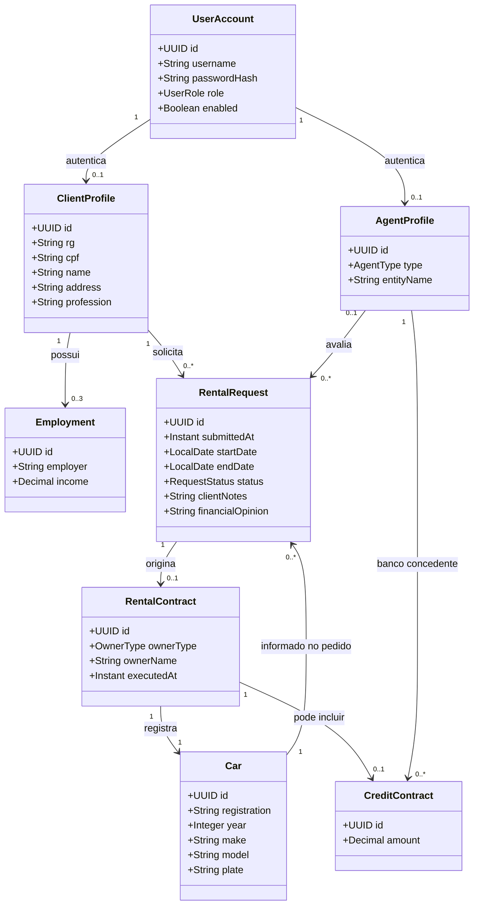

# Diagrama de classes — v1.0

```mermaid
classDiagram
    class UserAccount {
        +UUID id
        +String username
        +String passwordHash
        +UserRole role
        +Boolean enabled
    }
    class ClientProfile {
        +UUID id
        +String rg
        +String cpf
        +String name
        +String address
        +String profession
    }
    class AgentProfile {
        +UUID id
        +AgentType type
        +String entityName
    }
    class Employment {
        +UUID id
        +String employer
        +Decimal income
    }
    class Car {
        +UUID id
        +String registration
        +Integer year
        +String make
        +String model
        +String plate
    }
    class RentalRequest {
        +UUID id
        +Instant submittedAt
        +LocalDate startDate
        +LocalDate endDate
        +RequestStatus status
        +String clientNotes
        +String financialOpinion
    }
    class RentalContract {
        +UUID id
        +OwnerType ownerType
        +String ownerName
        +Instant executedAt
    }
    class CreditContract {
        +UUID id
        +Decimal amount
    }

    UserAccount "1" --> "0..1" ClientProfile : autentica
    UserAccount "1" --> "0..1" AgentProfile : autentica
    ClientProfile "1" --> "0..3" Employment : possui
    ClientProfile "1" --> "0..*" RentalRequest : solicita
    Car "1" --> "0..*" RentalRequest : informado no pedido
    AgentProfile "0..1" --> "0..*" RentalRequest : avalia
    RentalRequest "1" --> "0..1" RentalContract : origina
    RentalContract "1" --> "1" Car : registra
    RentalContract "1" --> "0..1" CreditContract : pode incluir
    AgentProfile "1" --> "0..*" CreditContract : banco concedente
```

`OwnerType` admite `CLIENT`, `COMPANY` ou `BANK`; `AgentType` admite `COMPANY` ou `BANK`; `UserRole` distingue cliente, agente de empresa e agente de banco.
